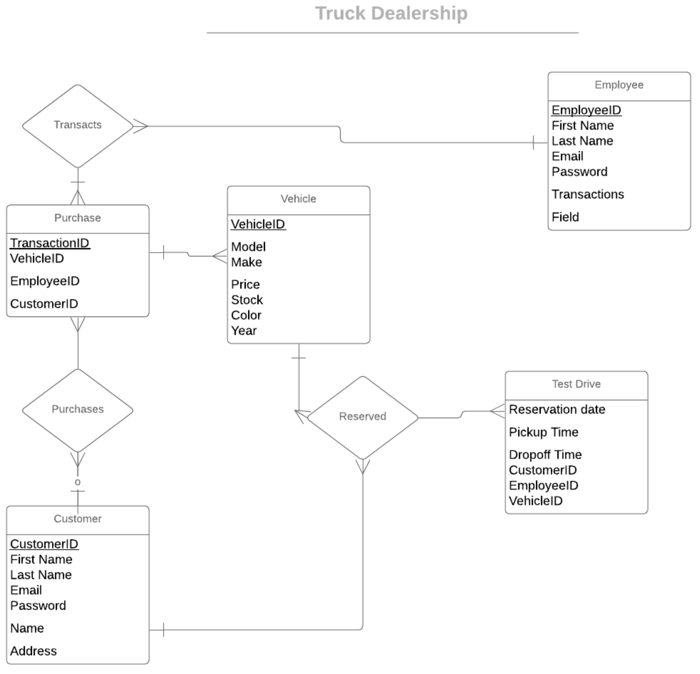

# Truck Dealership App
Final project for Comp 353

Tools used: Flask, Python, MySQL

# ER Diagram

Templates:

- Home

- Layout

- Login

- Create truck

- Truck display page (/truck/make/model/vin)

- Test drive page (submit post page is gonna be submit test drive page)

- Admin page for salesperson

- Admin page for customer
